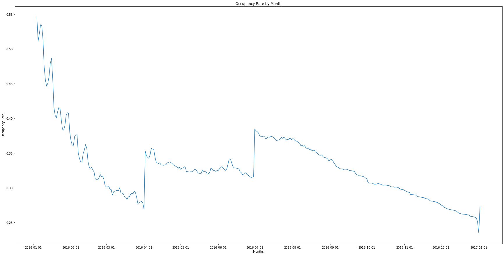

# Udacity Data Scientist Nanodegree
## Project: Writing a Data Scientist Blog Post

### Table of Contents

1. [Installation](#Installation)
2. [Project Motivation](#Project-Motivation)
3. [Data](#Data)
4. [File Descriptions](#File-Descriptions)
5. [Result](#Result)
6. [Blog](#Blog)

### Installation

This project requires **Python 3.x** and the following Python libraries installed:

- [SciPy](https://www.scipy.org/)
- [NumPy](http://www.numpy.org/)
- [Pandas](http://pandas.pydata.org/)
- [matplotlib](http://matplotlib.org/)
- [seaborn](https://seaborn.pydata.org/)
- [scikit-learn](http://scikit-learn.org/stable/)

You will also need to have software installed to run and execute an [iPython Notebook](http://ipython.org/notebook.html)

We recommend students install [Anaconda](https://www.continuum.io/downloads), a pre-packaged Python distribution that contains all of the necessary libraries and software for this project.

### Project Motivation

> For this project, I'm interested in answering following questions about Seattle AirBNB Listings.

1) What types of listings are popular?
2) When is the best time of the year to rent out a place?
3) How well can we predict the price of a listing? What aspects correlate well to listing prices?

### Data
The data used for the project is Seattle AirBNB Dataset and it can be downloaded from **Kaggle**:

### File Descriptions

Jupyter Notebook ([seattleairbnb.ipynb](https://github.com/eunbeejang/SeattleAirBNB/blob/main/seattleairbnb.ipynb)) works related to the above questions. 

### Result
- According to my analysis, the type and location of a property define the popularity of a listing. The trend differs from the room_type (i.e. entire place, private room, and shared room). For listings with the entire place, the most popular listings were Bed&Breakfast, Cabin, and Camper/RV located in Rainier Valley, Queen Anne, Northgate, and Ballard. For listings with private rooms, Bed&Breakfast, Cabin in Downtown and Queen Anne were popular. For shared units, apartments in University District were the most popular listing type.

*Correlation between neighbourhood and property type - Entire Place*

- The overall trend shows declining occupancy rates throughout the year 2016. This means that Airbnb renting activity in Seattle is decreasing. However, a surge in rental activities is observed between April and August 2016. There is another spike in renting activities in January 2017, which could be contributed by the end-of-the-year holiday season. Suppose a host is aiming to make a more significant profit in the Seattle area. In that case, they should target users booking for summer vacation or near the end of the year holiday.

*Occupancy rate by months between neighbourhood and property type - Entire Place*

- For modelling the listings' price, I utilized data columns related to the accommodation details without any host-written descriptions or images of the property. Using a linear regression model, the rsquared score for training data was 56% and 52% for testing data. This shows that the model is hard to generalize listing properties' pricing using the data columns provided. However, when analyzed, the coefficients, property type and location(neighbourhood) appears to be the main factors for pricing for given data.

### Blog
Check out my medium blog [[Link](https://eunbeejang-code.medium.com/what-sells-best-in-seattle-airbnb-4e20c87ad232)]

### Acknowledgments
- This project is part of [Udacity's Data Science Nano Degree](https://www.udacity.com/course/data-scientist-nanodegree--nd025?utm_source=gsem_brand&utm_medium=ads_r&utm_campaign=8826748925_c&utm_term=87779570854&utm_keyword=udacity%20data%20science_e&gclid=CjwKCAiA_9r_BRBZEiwAHZ_v12OTSQvjFxL-D4reFdMu8zEnWeQ5MRf5345qD1yIg4HF4-6x0ItYhhoCl9kQAvD_BwE)

- The data used for this project can be found here: [Seattle Airbnb Open Data](https://www.kaggle.com/airbnb/seattle/data)
